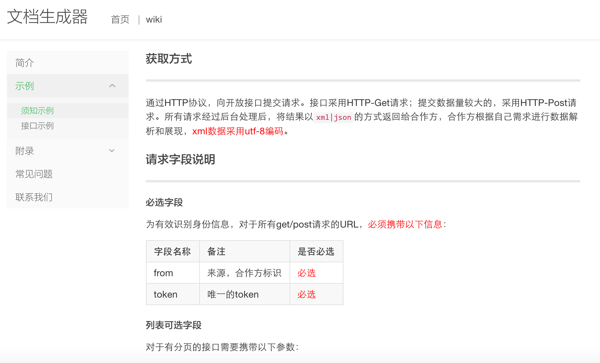

# markdown to html 文档生成器



## Usage

To use the template, set it up in your `couscous.yml` configuration file:

```yaml
template:
    url: https://github.com/echoOly/my_couscous
```

## Configuration

Here are all the variables you can set in your `couscous.yml`:

```yaml
# Base URL of the published website
baseUrl: http://username.github.io/project

# Used to link to the GitHub project
github:
    user: myself
    repo: my-project

title: My project
subTitle: This is a great project.

# The left menu bar
menu:
    items:
        home:
            text: Home page
            # You can use relative urls
            relativeUrl: doc/faq.html
        foo:
            text: Another link
            # Or absolute urls
            absoluteUrl: https://example.com
```

Note that the menu items can also contain HTML:

```yaml
home:
    text: "<i class=\"fa fa-github\"></i> Home page"
    relativeUrl: doc/faq.html
```

## Menu

To set the current menu item (i.e. highlighted menu item), set the `currentMenu`
key in the Markdown files:

```markdown
---
currentMenu: home
---

# Welcome
```
#使用说明
- curl -OS http://couscous.io/couscous.phar， 如果项目中已经存在不需要该操作
- php couscous.phar preview (deploy发布到gh-page)
- 编辑`couscous.yml`，自定义页面模板`default.twig`,编辑markdown文件。（示例已经存在）
- 将在.couscous/generated下生产html
- 浏览器中预览：`http://127.0.0.1:8000/`
- 如果报错，删除.couscous/ 即rm -rf .couscous

# 下载地址
https://github.com/echoOly/my_couscous

# 预览
http://doc.9aipay.com/

# 如有疑问
qq群：15717867

# 支持我们

- 微信


- 支付宝

